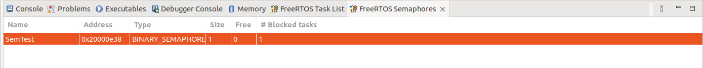

# Tp-Noyau-temps-reel

1.2 Sémaphores pour la synchronisation.
6. Changez les priorités. Expliquez les changements dans l’affichage.

1.5 Réentrance et exclusion mutuelle
11. Observez attentivement la sortie dans la console. Expliquez d’où vient le pro-
blème.
->la fonctiont printf n'est pas réentrante 

2 On joue avec le Shell

1. Terminer l’intégration du shell commencé en TD. Pour mémoire, les questions
du TD sont rappelées ci-dessous :
	3. Expliquer les mécanismes qui mènent à l’exécution de la fonction.
	4. Quel est le problème ?
	5. Proposer une solution

3.1 Gestion du tas

1. Quel est le nom de la zone réservée à l’allocation dynamique ?
	Dans le tas

2. Est-ce géré par FreeRTOS ou la HAL ?
	FreeRTOS
3. 

4. Notez la mémoire RAM et Flash utilisée,
	RAM --> 5.83%
	FLASH --> 3.24%
5. 
 		
6. Notez la nouvelle utilisation mémoire.
	Elle n'a pas changé, et cela est normal car on utilise le tas en dynamique alors que l'usage de la ram est en statique. 

7. On a augmenté la taille du tas à *10.

8. Notez la nouvelle utilisation mémoire. Expliquez les trois relevés.
	RAM --> 47.83%
	FLASH --> 3.12%
	
	Pour la dernière question on a changé la taille du tas en statique, ce qui explique que l'on voit le changement dans le build analyser. Pour les deux autres, on utilisait dynamiquement le tas, donc on ne voyais rien bouger. 

3.2 Gestion des piles

2. Dans CubeMX, configurez CHECK_FOR_STACK_OVERFLOW
	On choisit l'option 2 pour attraper le plus d'overflow possible. L'option 1 ne permet que de vérifier si le pointeur est resté dans l'espace de la pile a la fin de l'exécution, mais si entre temps nous sommes sortis de la pile nous le le saurons jamais.
	
4. Nous n'obtenons pas un overflow mais un HardFault_Handler ce qui signifie que l'on écrit plus loin que la mémoire. Notre pile doit se situer en bordure de la mémoire
	

3.3 Statistiques dans l'IDE	

4. 

8. Il faut d'abord donner un nom au sémaphore ou à la queue pour pouvoir l'afficher

